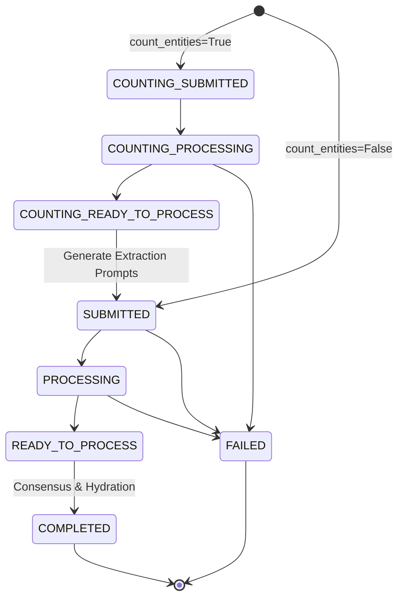

# Batch Processing Deep Dive

Batch processing in `extrai` is designed for high-volume extraction tasks where immediate results are not required and cost optimization is a priority. It leverages the "Batch API" features of LLM providers (like OpenAI's Batch API) to process requests asynchronously at a lower cost (often 50% cheaper).

## The Batch State Machine

The batch pipeline is managed by a robust state machine that transitions a job through various phases. This ensures that even long-running jobs can be tracked, resumed, and recovered in case of failures.

### States

The `BatchJobStatus` enum defines the possible states:

*   **SUBMITTED**: The initial extraction request has been sent to the LLM provider.
*   **PROCESSING**: The provider is currently running the batch.
*   **READY_TO_PROCESS**: The provider has finished, and the results are downloaded but not yet processed by `extrai`.
*   **COMPLETED**: All results have been processed, consensus run, and objects hydrated.
*   **FAILED**: The batch job failed at the provider or during local processing.
*   **CANCELLED**: The job was manually cancelled.

#### Counting Phase States

If entity counting is enabled, the job goes through a "pre-flight" counting phase:

*   **COUNTING_SUBMITTED**: The counting request is with the provider.
*   **COUNTING_PROCESSING**: Counting is running.
*   **COUNTING_READY_TO_PROCESS**: Counts are ready to be used for generating the main extraction prompts.

### State Transition Diagram



## Production Workflows

### Submission & Polling

The `WorkflowOrchestrator.synthesize_batch` method handles the lifecycle. You can use it in a blocking or non-blocking way.

**Blocking (Simplest):**
```python
results = await orchestrator.synthesize_batch(
    input_strings=docs, 
    wait_for_completion=True
)
```
This will poll the provider internally, handle transitions from counting to extraction, and return the final objects.

**Non-Blocking (Async):**
```python
# Submit
batch_id = await orchestrator.synthesize_batch(
    input_strings=docs, 
    wait_for_completion=False
)

# Later... check status
current_status = await orchestrator.get_batch_status(batch_id, db_session)
if current_status.status == BatchJobStatus.COMPLETED:
    results = await orchestrator.get_batch_results(batch_id)
```

### Error Recovery & Resuming

If your application crashes while a batch is running, you don't lose the job. The `root_batch_id` is the key to recovery.

**Resuming Monitoring (e.g. after script restart)**

If the batch job is still active or completed at the provider, but your script stopped monitoring it, simply call `monitor_batch_job` again:

```python
# Resume monitoring
results = await orchestrator.monitor_batch_job(
    root_batch_id="batch_123_abc",
    db_session=session,
    poll_interval=60
)
```
This method inspects the current state (e.g., `COUNTING_SUBMITTED`, `READY_TO_PROCESS`) and automatically picks up where it left off, handling transitions between phases.

**Retrying or Extending a Batch**

If a batch failed or if you want to extend a completed workflow (e.g., adding more hierarchical steps), use `create_continuation_batch`. This creates a *new* batch job that copies the successful steps from the old one, saving time and money.

```python
# Continue from step 2
new_batch_id = await orchestrator.create_continuation_batch(
    original_batch_id="failed_batch_id",
    db_session=session,
    start_from_step_index=2, # Copy steps 0 and 1, restart from 2
    wait_for_completion=True
)
```

## Hierarchical Batches & Shallow Schemas

When using `use_hierarchical_extraction=True` with batches, the process involves multiple "hops".

1.  **Level 1 Extraction**: The root object is extracted.
2.  **Shallow Schema Generation**: For lists of children, `extrai` generates "Shallow Schemas" (just IDs and essential fields) to keep the context window small.
3.  **Child Batches**: New batch jobs are spawned for each child entity to extract full details.

This complex coordination is handled automatically by the `BatchPipeline`.
